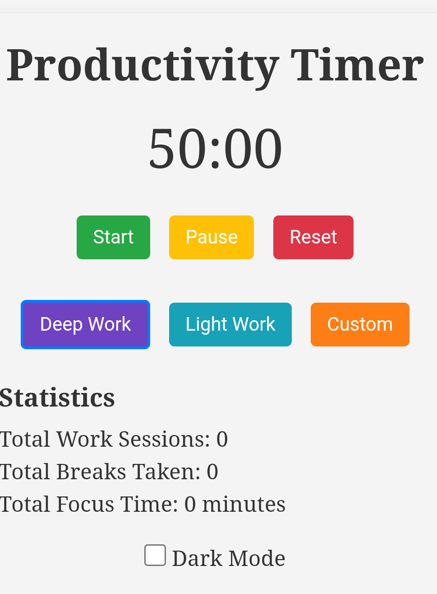

# Productivity Timer



[GitHub Repository](https://github.com/yasinULLAH/Productivity-timer)

## Overview

The **Productivity Timer** is a customizable productivity tool designed to help users manage their work and break intervals effectively. Inspired by the Pomodoro Technique, this web application allows users to focus on their tasks with dedicated focus modes, track their productivity statistics, and personalize their experience with various settings.

## Features

- **Start, Pause, Reset Timer**: Control your productivity sessions with ease.
- **Focus Modes**:
  - **Deep Work**: Extended focus periods for intensive tasks.
  - **Light Work**: Shorter sessions for lighter tasks.
  - **Custom**: Set your own work and break durations.
- **Statistics Tracking**:
  - Total Work Sessions
  - Total Breaks Taken
  - Total Focus Time
- **Dark Mode**: Toggle between light and dark themes for a comfortable viewing experience.
- **Responsive Design**: Optimized for both desktop and mobile devices.
- **Sound Notifications**: Alerts for session transitions.

## Technologies Used

- **HTML**: Structure of the application.
- **CSS**: Styling and responsive design.
- **JavaScript**: Functionality and interactivity.

## Installation & Usage

1. **Clone the Repository**:
    ```bash
    git clone https://github.com/yasinULLAH/Productivity-timer.git
    ```
2. **Navigate to the Project Directory**:
    ```bash
    cd Productivity-timer
    ```
3. **Open the Application**:
    - Open `index.html` in your preferred web browser.
    - You can do this by double-clicking the `index.html` file or using a local server.

## How to Use

1. **Select Focus Mode**:
    - Choose between **Deep Work**, **Light Work**, or **Custom** modes.
    - If **Custom** is selected, set your desired work and break durations.

2. **Start the Timer**:
    - Click the **Start** button to begin your session.

3. **Pause or Reset**:
    - Use the **Pause** button to temporarily halt the timer.
    - Click **Reset** to restart the session.

4. **Track Your Productivity**:
    - View your statistics under the **Statistics** section.
    - Track total work sessions, breaks taken, and total focus time.

5. **Toggle Theme**:
    - Switch between light and dark modes using the toggle switch at the bottom.

## Screenshots


## Contributing

Contributions are welcome! If you have suggestions or improvements, feel free to fork the repository and submit a pull request.

1. **Fork the Repository**
2. **Create a New Branch**:
    ```bash
    git checkout -b feature/YourFeature
    ```
3. **Commit Your Changes**:
    ```bash
    git commit -m "Add your feature"
    ```
4. **Push to the Branch**:
    ```bash
    git push origin feature/YourFeature
    ```
5. **Open a Pull Request**

## License

This project is open-source and available under the [MIT License](LICENSE).

## Contact

For any inquiries or support, please open an issue on the [GitHub repository](https://github.com/yasinULLAH/Productivity-timer).

---

Happy Productivity!
